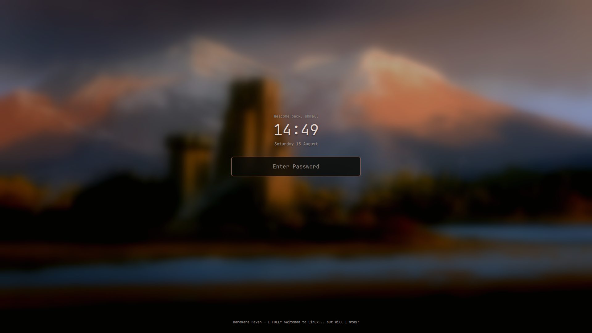

# Media + Face Lock Screen for Omarchy 4

A drop-in Omarchy 4 lock service with a large clock, MPRIS now-playing details,
password and fingerprint fallback, and automatic face unlock through Howdy.



This project is derived from
[shmall03's Media Lock Screen](https://github.com/shmall03/omarchy-shmall.lock-plugin)
and Omarchy's built-in `omarchy.lock` service.

## Security model

Face, fingerprint, and password authentication use three independent PAM
services. Face recognition never replaces password authentication. Howdy's own
documentation warns that face recognition is a convenience feature and may be
fooled by a similar-looking person or a photograph; an IR camera is strongly
recommended.

The plugin only starts face authentication after the Wayland session lock is
secure. Failed scans retry once per second without blocking the password field.

## Requirements

- Omarchy 4.x with the Quickshell lock service
- A working camera (preferably IR)
- `howdy-git` from the AUR
- `/etc/pam.d/omarchy-lock-password` (provided by Omarchy)

## Install

Add the public repository first. It remains disabled while you review and
configure its privileged dependency:

```bash
omarchy plugin add https://github.com/hpastrana/omarchy-face-lock-plugin.git
```

Configure and enroll Howdy from the installed checkout. This step is
interactive and uses `sudo`
because package installation, face enrollment, and PAM configuration are
privileged operations:

```bash
~/.config/omarchy/plugins/hpastrana.face-lock/scripts/setup-face-auth
```

Review the AUR package when prompted. The setup script verifies Omarchy 4,
installs `howdy-git` when needed, configures the camera, enrolls and tests your
face, installs an isolated PAM service, and writes a per-user enrollment marker.

After the test succeeds, enable the plugin:

```bash
omarchy plugin enable hpastrana.face-lock
```

It declares `clonedFrom: omarchy.lock`, so enabling it disables the built-in
lock implementation. Preview it before locking:

```bash
omarchy-shell lock preview
omarchy-shell lock hidePreview
```

Test from a spare TTY before relying on it. Password unlock remains available
at all times.

## Compatibility

The plugin targets Omarchy 4.x and its Quickshell-based `omarchy.lock`
service. The setup script refuses to change PAM on other major versions.

## Update

```bash
omarchy plugin update hpastrana.face-lock
```

## Remove

Remove the shell plugin:

```bash
omarchy plugin remove hpastrana.face-lock --yes
```

Optionally remove only this plugin's PAM service and enrollment marker:

```bash
~/.config/omarchy/plugins/hpastrana.face-lock/scripts/remove-face-auth
```

This deliberately does not uninstall Howdy or delete its face models because
other PAM services may use them.

## License

MIT. See [LICENSE](LICENSE).

The lock-screen UI is derived from shmall03's MIT-licensed Media Lock Screen
and Omarchy's MIT-licensed built-in lock service. Their notices are preserved.
